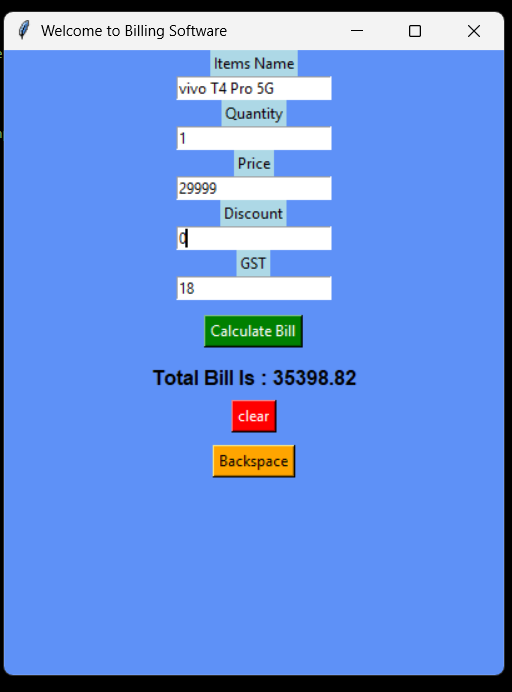

# 🧾 Billing Software using Python Tkinter

A simple and beginner-friendly Billing Software built with **Python** and **Tkinter GUI**. This application allows users to calculate bills by entering item quantity, price, discount percentage, and GST percentage. The software automatically generates the final bill amount and provides clear and backspace functionality.

---

## 🚀 Features

- ✅ Simple Tkinter GUI Interface
- ✅ Item Name Input
- ✅ Quantity & Price Calculation
- ✅ Discount Percentage Support
- ✅ GST Calculation
- ✅ Final Bill Generation
- ✅ Clear All Fields Option
- ✅ Backspace Functionality
- ✅ Lightweight & Easy to Use

---

## 🛠️ Technologies Used

- Python 3
- Tkinter (GUI Library)

---

## 📋 How to Use

1. Enter the **Item Name**.
2. Enter **Quantity**.
3. Enter **Price**.
4. Enter **Discount (%)**.
5. Enter **GST (%)**.
6. Click **Calculate Bill**.
7. View the final bill amount.
8. Use **Clear** to reset all fields.
9. Use **Backspace** to remove the last character from the selected input field.

---

## 🧮 Billing Formula

```text
Total = Quantity × Price

Discount Amount = Total × Discount / 100

Total After Discount = Total - Discount Amount

GST Amount = Total After Discount × GST / 100

Final Bill = Total After Discount + GST Amount
```

---

## 📂 Project Structure

```text
Billing-Software/
│
├── billing_software.py
├── README.md
└── screenshots/
```

---

## ▶️ Run the Project

### Clone the Repository

```bash
git clone https://github.com/your-username/Billing-Software.git
```

### Navigate to Project Folder

```bash
cd Billing-Software
```

### Run the Program

```bash
python billing_software.py
```

---

## 🎯 Learning Objectives

This project helps beginners learn:

- Tkinter GUI Development
- Labels, Buttons, and Entry Widgets
- Function Handling
- Event-Based Programming
- User Input Processing
- Basic Billing Calculations

---

## 🔮 Future Improvements

- Multiple Item Billing
- Receipt Generation
- PDF Export
- Database Integration
- Bill History Storage
- Better Error Handling
- Print Bill Feature

---

## 📸 Preview


Simple desktop billing application featuring:

- Item Name Entry
- Quantity & Price Inputs
- Discount Calculation
- GST Calculation
- Final Bill Display
- Clear & Backspace Buttons

---

## 👨‍💻 Author

Developed using **Python** and **Tkinter** as a beginner-friendly Billing Management System project.

⭐ If you found this project useful, don't forget to star the repository!
